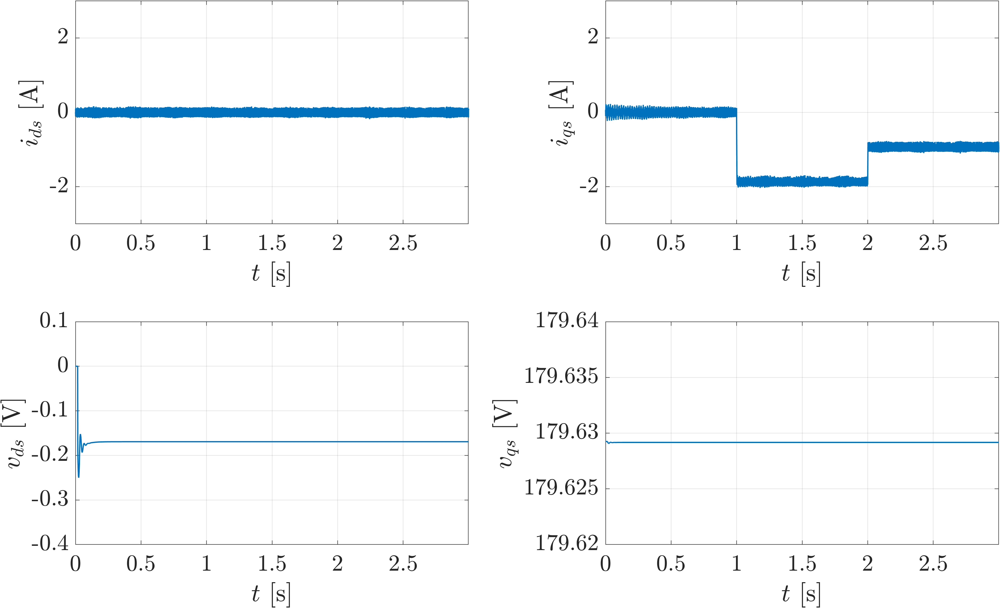
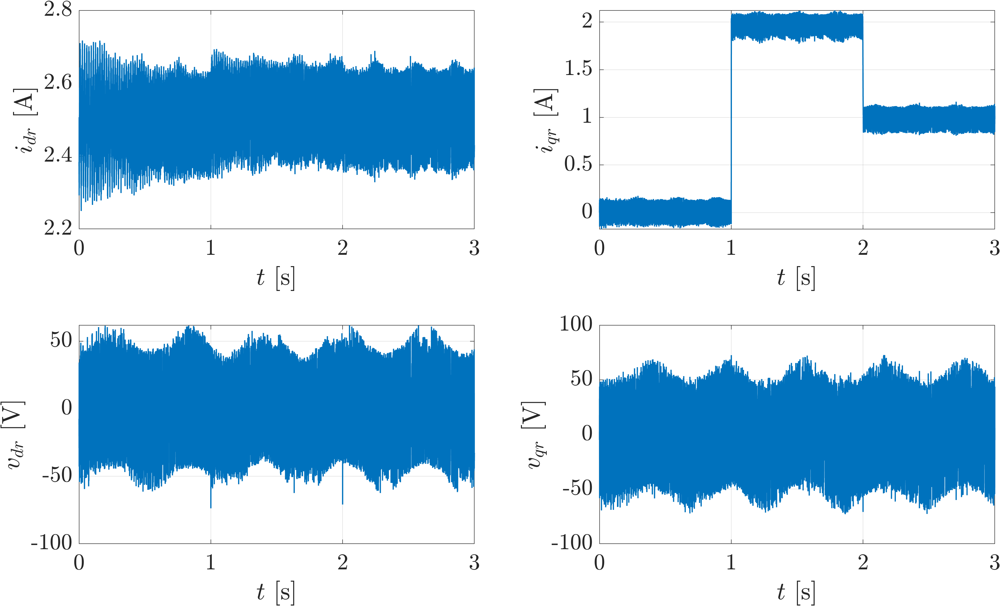

## Introdução

* **Contexto:** Estudo da Máquina de Indução Duplamente Alimentada (DFIG) em sistemas eólicos.
* **Objetivo:** Obtenção de um modelo matemático discreto para estimação de correntes.
* **Aplicações:** Base para controle preditivo (MPC) e observadores de estado.

---


## Modelo Físico - Analítico do DFIG (Referencial $dq$)

O modelo dinâmico no referencial síncrono é descrito pelas equações de tensão:

$$
\begin{aligned}
v_{ds} &= R_s i_{ds} + \frac{d\psi_{ds}}{dt} - \omega_s \psi_{qs} \\
v_{qs} &= R_s i_{qs} + \frac{d\psi_{qs}}{dt} + \omega_s \psi_{ds} \\
v_{dr} &= R_r i_{dr} + \frac{d\psi_{dr}}{dt} - (\omega_s - \omega_r) \psi_{qr} \\
v_{qr} &= R_r i_{qr} + \frac{d\psi_{qr}}{dt} + (\omega_s - \omega_r) \psi_{dr}
\end{aligned}
$$

---

## Relações de Fluxo

As correntes são acopladas magneticamente através das indutâncias:

$$
\begin{cases}
\psi_{ds} = L_s i_{ds} + L_m i_{dr} \\
\psi_{qs} = L_s i_{qs} + L_m i_{qr} \\
\psi_{dr} = L_m i_{ds} + L_r i_{dr} \\
\psi_{qr} = L_m i_{qs} + L_r i_{qr}
\end{cases}
$$

Este acoplamento justifica a inclusão de todas as correntes como regressores em uma modelagem por identificação.

---

# Conjunto de dados

* **Simulação da Planta:** Modelo analítico do DFIG implementado em Simulink.
* **Sinais de Entrada:** Tensões $v_{ds}, v_{qs}, v_{dr}, v_{qr}$.
* **Sinais de Saída:** Correntes $i_{ds}, i_{qs}, i_{dr}, i_{qr}$.

---

Carregando os dados no MATLAB - arquivo `DadosDFIG.mat`:

```matlab
clear, clc

load DadosDFIG.mat

t = DadosDFIG.Time;             % Vetor de tempo;
Ts = t(2)-t(1);                 % Período de amostragem;
N = length(t);                  % Número de amostras;
Ids = DadosDFIG.Data(:,1);      % Corrente d do estator;
Iqs = DadosDFIG.Data(:,2);      % Corrente q do estator;
Idr = DadosDFIG.Data(:,3);      % Corrente d do rotor;
Iqr = DadosDFIG.Data(:,4);      % Corrente q do rotor;
Vds = DadosDFIG.Data(:,5);      % Tensão d do estator;
Vqs = DadosDFIG.Data(:,6);      % Tensão q do estator;
Vdr = DadosDFIG.Data(:,7);      % Tensão d do rotor;
Vqr = DadosDFIG.Data(:,8);      % Tensão q do rotor;

subplot(2,4,1), plot(t,Ids), grid, title('Ids')
subplot(2,4,2), plot(t,Iqs), grid, title('Iqs')
subplot(2,4,3), plot(t,Idr), grid, title('Idr')
subplot(2,4,4), plot(t,Iqr), grid, title('Iqr')
subplot(2,4,5), plot(t,Vds), grid, title('Vds')
subplot(2,4,6), plot(t,Vqs), grid, title('Vqs')
subplot(2,4,7), plot(t,Vdr), grid, title('Vdr')
subplot(2,4,8), plot(t,Vqr), grid, title('Vqr')
```

---

### Tensões e Correntes $d-q$ do Estator 





---

### Tensões e Correntes $d-q$ do Rotor 




---

## Modelo ARX

Cada corrente é representada por um modelo ARX - MISO. Para uma corrente genérica $i_x$ (onde $x \in \{ds, qs, dr, qr\}$):

$$i_x(t) + \color{red}{\sum_{k=1}^{n_a} a_k i_x(t-k)} = \color{forestgreen}{\sum_{j \in \text{outras}} \sum_{k=1}^{n_a} c_{jk} i_j(t-k)} + \color{blue}{\sum_{p=1}^{4} \sum_{k=1}^{n_b} b_{pk} v_p(t-k)} + e(t)$$

### Regressores:

* <b style="color:red;">Termos Autorregressivos:</b> Dependência do passado da própria corrente $i_x$.
* <b style="color:forestgreen;">Termos de Acoplamento $i_j$:</b> Influência das outras 3 correntes da máquina.
* <b style="color:blue;">Termos Exógenos $v_p$:</b> Influência das 4 tensões da máquina $v_{ds}, v_{qs}, v_{dr}, v_{qr}$.

Para $n_a$ atrasos de corrente e $n_b$ de tensões o modelo possui $L = 4n_a + 4n_b$ termos.

---

## Modelo ARX

Aplicando as $N$ amostras de dados ao modelo, pode-se expresá-lo na forma vetorial matricial:

$$\mathbf{y}_x = \Phi_x \theta_x + \mathbf{e}$$

* **Vetor de Saída:** $\mathbf{y}_x \in \mathbb{R}^{(N-n_m) \times 1}$ Vetor de amostras medidas $i_x$ que se deseja prever;
$$\mathbf{y}_x = [i_x(n_{m}+1), i_x(n_{m}+2), \dots, i_x(N)]^T$$
* **Matriz de Regressão:** $\mathbf{y}_x \in \mathbb{R}^{(N-n_m) \times 1}$ Cada coluna associada a um regressor;
* **Vetor de Parâmetros:** $\Phi_x \in \mathbb{R}^{(N-n_m) \times L}$ Vetor de parâmetros a ser estimado.
$$\theta_x = [ \underbrace{\color{red}{a_1, \dots, a_{n_a}}}_{\text{Auto-Regressivo}} \mid \underbrace{\color{forestgreen}{c_1, \dots, c_{3n_a}}}_{\text{Acoplamento}} \mid \underbrace{\color{blue}{b_1, \dots, b_{4n_b}}}_{\text{Exógenos}} ]^T$$
* **Vetor de erro:** $e_x \in \mathbb{R}^{L \times 1}$ Incertezas de medição e distúrbios não modelados.

---

## Matriz de Regressão $\Phi_x$

Regressores para identificação do ARX para $i_x \in \{i_{ds}, i_{qs}, i_{dr}, i_{qr}\}$:

- Vetor de regressores  $\phi_x(t)$, com dimensão

$$\phi_x(t) = [ \underbrace{\color{red}{i_x(t-1), \dots, i_x(t-n_a)}}_{\text{Dinâmica de } i_x} \mid \underbrace{\color{forestgreen}{i_j(t-1), \dots, i_j(t-n_a)}}_{\text{Acoplamentos } j \neq x} \mid \underbrace{\color{blue}{v_p(t-1), \dots, v_p(t-n_b)}}_{\text{Entradas Exógenas}} ]$$

- Matriz de regressão, com linhas $\phi_x(t)$  de $t = n_{m}+1$ até $N$:

$$\Phi_x = \begin{bmatrix} \phi_x(n_{m}+1) \\ \phi_x(n_{m}+2) \\ \vdots \\ \phi_x(N) \end{bmatrix} \in \mathbb{R}^{(N-n_{m}) \times L}$$


---

## Estimação por Mínimos Quadrados

Para cada corrente $\mathbb{i}_x$ busca-se determinar $\hat{\theta}_x$ que minimiza $\mathbf{e} = \mathbf{y}_x - \Phi_x \theta_x$ em

$$\mathbf{y}_x = \Phi_x \theta_x + \mathbf{e}.$$

- Por otimização, a minimização quadrática é dada por:

$$\hat{\theta}_x = \min_{\theta_x} \|\mathbf{y}_x - \Phi_x \theta_x\|^2$$

- Que também é deteminado por:

$$\hat{\theta}_x = (\Phi_x^T \Phi_x)^{-1} \Phi_x^T \mathbf{y}_x$$

---

# Codificação Matlab: 


```{matlab}
%% Variáveis e parâmetros:
U = [Vds, Vqs, Vdr, Vqr]; % Entradas (Tensões dq)
Y = [Ids, Iqs, Idr, Iqr]; % Saídas (Correntes dq)
N = length(t);

%% Configura do modelo ARX:
na = 2; nb = 2;          % Atrasos das variáveis
n_max = max(na, nb);     % Número máximo de parâmetros
Theta = zeros(4*na+4*nb, 4);
```

---

```{matlab}


for c = 1:4
    % Montagem da Matriz de Regressão Phi
    Phi = [];
    for j = 1:4
        for k = 1:na, Phi = [Phi, Y(n_max+1-k:N-k, j)]; end
    end
    for j = 1:4
        for k = 1:nb, Phi = [Phi, U(n_max+1-k:N-k, j)]; end
    end

    % Estimação Mínimos Quadrados
    Y_real = Y(n_max+1:N, c);
    theta_c = (Phi' * Phi) \ (Phi' * Y_real);
    Theta(:, c) = theta_c;

    % Validação (FIT)
    Y_sim = Phi * theta_c;
    fit = 100 * (1 - norm(Y_real - Y_sim)/norm(Y_real - mean(Y_real)));
end
```


---

## Parâmetros Identificados: Matriz $\Theta$ {.smaller scrollable="true"}

$$\Theta = [\theta_{ids} \quad \theta_{iqs} \quad \theta_{idr} \quad \theta_{iqr}] \;\; \in \mathbb{R}^{16 \times 4}$$

| Termo | Regressor | $i_{ds}$ | $i_{qs}$ | $i_{dr}$ | $i_{qr}$ |
|:---:|:---|:---:|:---:|:---:|:---:|
| <b style="color:red;">$a_1$</b> | $i_x(t-1)$ | 153.6803 | 28.0080 | -157.3424 | -28.6244 |
| <b style="color:red;">$a_2$</b> | $i_x(t-2)$ | -152.7904 | -28.0289 | 157.4577 | 28.6444 |
| <b style="color:forestgreen;">$c_1$</b> | $i_{j1}(k-1)$ | -48.4168 | -8.9348 | 50.7214 | 10.4027 |
| <b style="color:forestgreen;">$c_2$</b> | $i_{j1}(t-2)$ | 48.1307 | 9.8816 | -50.4247 | -10.3484 |
| <b style="color:forestgreen;">$c_3$</b> | $i_{j2}(t-1)$ | 144.7399 | 26.7092 | -148.1438 | -27.2969 |
| <b style="color:forestgreen;">$c_4$</b> | $i_{j2}(t-2)$ | -144.8269 | -26.7310 | 149.2349 | 27.3179 |
| <b style="color:forestgreen;">$c_5$</b> | $i_{j3}(t-1)$ | -46.1789 | -10.3606 | 48.3770 | 11.8498 |
| <b style="color:forestgreen;">$c_6$</b> | $i_{j3}(t-2)$ | 45.9072 | 10.3103 | -48.0952 | -10.7984 |
| <b style="color:blue;">$b_1$</b> | $v_1(t-1)$ | -0.7344 | -0.1441 | 0.7695 | 0.1381 |
| <b style="color:blue;">$b_2$</b> | $v_1(t-2)$ | 0.7305 | 0.1436 | -0.7654 | -0.1376 |
| <b style="color:blue;">$b_3$</b> | $v_2(t-1)$ | -1.1802 | -0.2355 | 1.1953 | 0.2496 |
| <b style="color:blue;">$b_4$</b> | $v_2(t-2)$ | 1.1814 | 0.2358 | -1.1966 | -0.2498 |
| <b style="color:blue;">$b_5$</b> | $v_3(t-1)$ | -0.0000 | -0.0000 | 0.0000 | 0.0000 |
| <b style="color:blue;">$b_6$</b> | $v_3(t-2)$ | 0.0000 | 0.0000 | -0.0000 | -0.0000 |
| <b style="color:blue;">$b_7$</b> | $v_4(t-1)$ | 0.0000 | -0.0000 | -0.0000 | 0.0000 |
| <b style="color:blue;">$b_8$</b> | $v_4(t-2)$ | -0.0000 | 0.0000 | 0.0000 | -0.0000 |

---

## Modelo ARX para predição para $i_{ds}(t)$

A predição de $i_{ds}(t)$ é obtida pela combinação linear dos regressores com os coeficientes de $\Theta$:

$$
\begin{aligned}
\hat{i}_{ds}(t) = \quad & \color{red}{a_1 i_{ds}(t-1) + a_2 i_{ds}(t-2)} \\
+ & \color{forestgreen}{c_1 i_{qs}(t-1) + c_2 i_{qs}(t-2)} \\
+ & \color{forestgreen}{c_3 i_{dr}(t-1) + c_4 i_{dr}(t-2)} \\
+ & \color{forestgreen}{c_5 i_{qr}(t-1) + c_6 i_{qr}(t-2)} \\
+ & \color{blue}{b_1 v_{ds}(t-1) + b_2 v_{ds}(t-2)} \\
+ & \color{blue}{b_3 v_{qs}(t-1) + b_4 v_{qs}(t-2)} \\
+ & \color{blue}{b_5 v_{dr}(t-1) + b_6 v_{dr}(t-2)} \\
+ & \color{blue}{b_7 v_{qr}(t-1) + b_8 v_{qr}(t-2)}
\end{aligned}
$$


 - Como o ARX é **invariante no tempo**, a predição de $\hat{i}_{ds}(t+1)$ é obtida deslocando todas as amostras um passo à frente.
